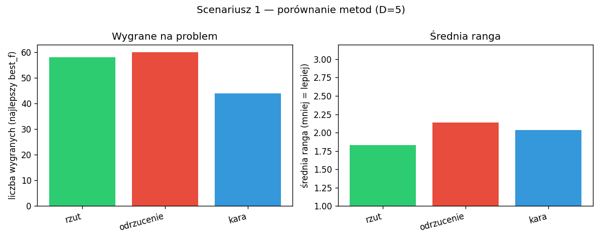
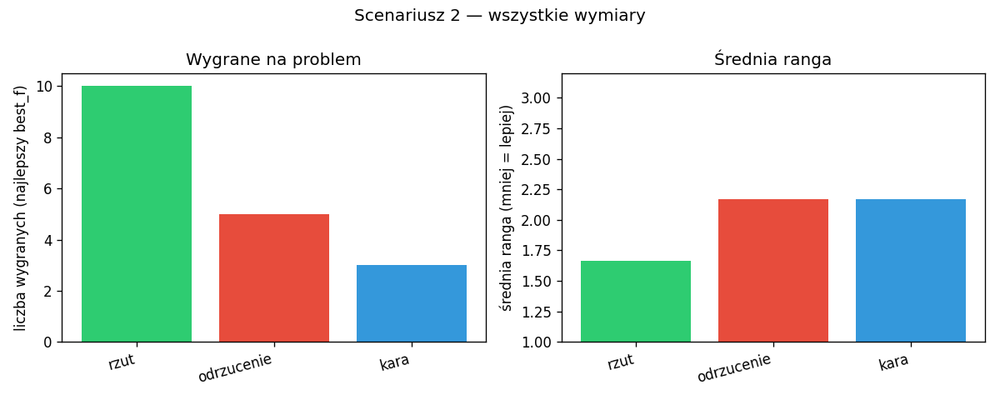
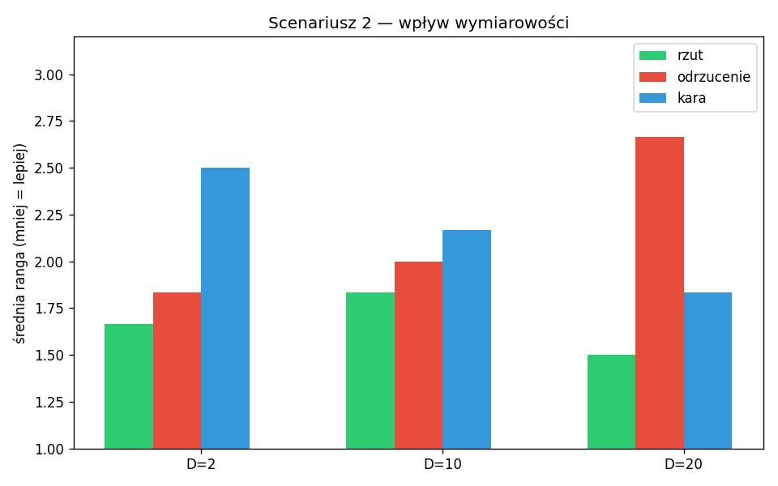
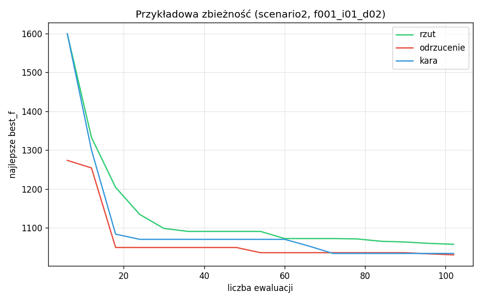
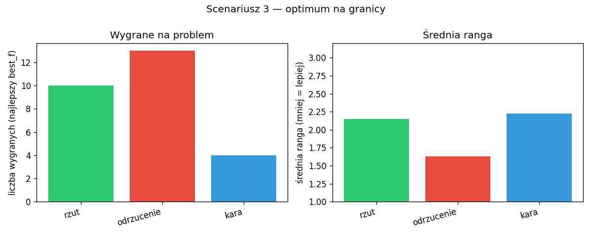
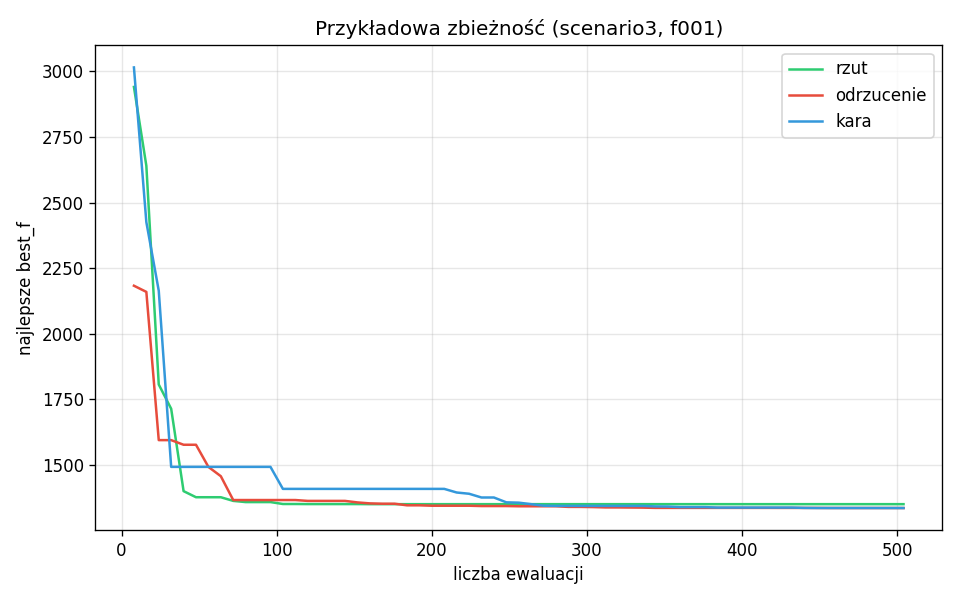

# Wyniki i wykresy

Porównywane są **3 metody** obsługi ograniczeń w CMA-ES:

| Kod | Nazwa | Opis |
|-----|--------|------|
| `project` | rzut | Osobnik poza obszarem dopuszczalnym jest przesuwany w stronę średniej populacji, aż trafi na brzeg |
| `reject` | odrzucenie | Niedopuszczalny osobnik jest zastępowany losowym punktem z dopuszczalnego obszaru |
| `penalty` | kara | Do wartości funkcji celu dodawana jest kara za naruszenie ograniczeń |

Benchmark: **bbob-constrained** (`cocoex`).

---

## Pliki wspólne

- **`podsumowanie.md`** — liczba przebiegów, wygrane, średnia ranga, `target_hit` (tekst).

---

## Scenariusz 1 — porównanie skuteczności (D = 5)

**Cel:** pełny zestaw bbob-constrained w 5 wymiarach (funkcje 1–54, instancje 1–3).  
**Dane:** `results/scenario1/`

### `scenario1_ranking.png`

Lewy panel: ile problemów metoda **wygrała** (najniższe `best_f` na tym zadaniu).  
Prawy panel: **średnia ranga** (1 = najlepiej, 3 = najgorzej) na całym scenariuszu.

### `scenario1_convergence.png`

Przykładowa **zbieżność** na jednym problemie: oś X = ewaluacje, oś Y = najlepsze `best_f`; trzy krzywe = rzut, odrzucenie, kara.

---

## Scenariusz 2 — wpływ wymiarowości (D = 2, 10, 20)

**Cel:** wpływ wymiaru (m.in. słabość odrzucania przy 10 i 20). Funkcje: f1, f2, f3, f7, f19, f43.  
**Dane:** `results/scenario2/`

### `scenario2_ranking.png`

Ranking zebrany **dla wszystkich wymiarów** naraz (2, 10, 20).

### `scenario2_by_dimension.png`

**Średnia ranga** osobno dla D = 2, 10 i 20 — widać, czy metoda się pogarsza w wyższych wymiarach.

### `scenario2_convergence.png`

Przykładowa zbieżność w **2D** (np. f001).

---

## Scenariusz 3 — stabilność na granicy ograniczeń

**Cel:** funkcje z **1 ograniczeniem** (f1, f7, f13, …, f49) — optimum na brzegu.  
**Dane:** `results/scenario3/`

### `scenario3_ranking.png`

Wygrane i średnia ranga tylko na zadaniach „na granicy” (D = 5).

### `scenario3_convergence.png`

Przykładowa zbieżność na jednym z tych problemów.

---

## Jak czytać wyniki

- Ranking po **`best_f`** (niżej = lepiej w porównaniu na tym samym problemie).
- To **nie** jest wykres ECDF z COCO (ten z logów w `exdata/results_coco/` + `cocopp`).
- **`target_hit`** w `podsumowanie.md` — czy COCO uznało osiągnięcie celu przy dopuszczalnym postępie.

